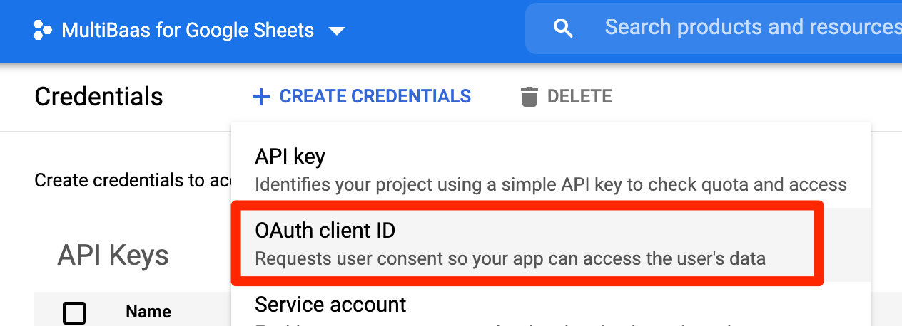

# MultiBaas for Google Sheets

This spreadsheet plugin was originally developed as part of the [ETHGlobal HackMoney hackathon](https://hack.ethglobal.co/showcase/sunset-supreme-rec3QkXTn6lVq3TH0), where it was called _Sunset Supreme Spreadsheet Blockchain Plugin_. We made the following submissions as part of our entry:

- [Live Demo Spreadsheet](https://docs.google.com/spreadsheets/d/1AHCYefYNCjU80X1aSs8Ebre85nVtBeu1cVWmXDIz0_0/edit?usp=sharing)
- [Demo Video](https://youtu.be/YsbzTZ6Cfvc)
- [Presentation Slides](Sunset%20Supreme%20Spreadsheet%20Blockchain%20Machine.pdf)

## Prerequisite

You should deploy a MultiBaas instance before following steps below.

- [Deploy MultiBaas](https://www.curvegrid.com/docs/3-0-getting-started-creating-a-multibaas-deployment/)

## Developing

- node.js v12.16.0 or higher
- [clasp](https://developers.google.com/apps-script/guides/clasp)

Install clasp globally

```sh
yarn global add @google/clasp
```

or if you use `npm`

```sh
npm install @google/clasp -g
```

Install local node.js packages

```sh
yarn install
```

or

```sh
npm install
```

## Testing in a command

**Spreadsheet**

You need to prepare for a spreadsheet with small configuration.


**Link Apps Script to GCP**

In order to run tests you need to link Apps Script project to GCP project.

Copy a `Project number` from GCP project settings.


Link **Apps Script** project to **GCP** project.


**Credentials and Environments Variables**

You need to create `.client-secret.json`, `.credentials.json`, `.clasp.json`, and `.testSheet.json` files

- `.client-secret.json` and `.credentials.json` are used in `auth.js`
- `.clasp.json` and `.testSheet.json` files are used in `mbSheetsAddOn.js`

`.client-secret.json` is to set your GCP project. You should download form credential settings as follows:





This is the client-secret file.

```json
{
  "installed": {
    "client_id": "[YOUR GCP PROJECT CLIENT ID]",
    "project_id": "[YOUR GCP PROJECT PROJECT ID]",
    "auth_uri": "https://accounts.google.com/o/oauth2/auth",
    "token_uri": "https://oauth2.googleapis.com/token",
    "auth_provider_x509_cert_url": "https://www.googleapis.com/oauth2/v1/certs",
    "client_secret": "[YOUR GCP PROJECT CLIENT SECRET]",
    "redirect_uris": [
      "urn:ietf:wg:oauth:2.0:oob",
      "http://localhost"
    ]
  }
}
```

`.clasp.json` is to set your Apps Script project after you create a new one.

```json
{"scriptId": "[YOUR APPS SCRIPT ID]"}
```

`.testSheet.json` file in the project root is to set a test sheet URL.

```json
{"url": "[YOUR SPREADSHEET URL]"}
```

Run `yarn test` to retrieve a token for `.credentials.json`.

```sh
yarn test
```

If you don't have `.credentials.json` then you will see this prompt:

```sh
yarn test
yarn run v1.22.10
$ clasp push && cd test && node mbSheetsAddOn.js
└─ appsscript.json
└─ src/Code.js
└─ src/Code.spec.js
└─ src/library/Build.js
└─ src/library/Property.js
└─ src/library/Query.js
└─ src/library/Util.js
└─ src/library/Validate.js
Pushed 8 files.
authorize this app by visiting this url: https://accounts.google.com/o/oauth2/v2/auth?access_type=offline&scope=https%3A%2F%2Fwww.googleapis.com%2Fauth%2Fscript.external_request%20https%3A%2F%2Fwww.googleapis.com%2Fauth%2Fspreadsheets&response_type=code&client_id=966627203108-e6125d7hosngl429qh6b52old6b7r98t.apps.googleusercontent.com&redirect_uri=urn%3Aietf%3Awg%3Aoauth%3A2.0%3Aoob
Enter the code from that page here:
```

Just follow the URL and authenticate your account then you can retrieve a code to create `.credentials.json` file.

## Linter

```sh
yarn lint
```
