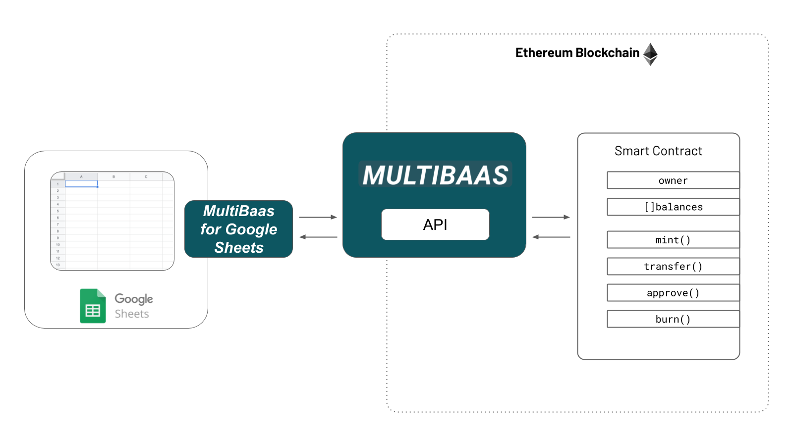

# MultiBaas for Google Sheets

This spreadsheet plugin was originally developed as part of the [ETHGlobal HackMoney hackathon](https://hack.ethglobal.co/showcase/sunset-supreme-rec3QkXTn6lVq3TH0), where it was called _Sunset Supreme Spreadsheet Blockchain Plugin_. We made the following submissions as part of our entry:

- [Live Demo Spreadsheet](https://docs.google.com/spreadsheets/d/1AHCYefYNCjU80X1aSs8Ebre85nVtBeu1cVWmXDIz0_0/edit?usp=sharing)
- [Demo Video](https://youtu.be/YsbzTZ6Cfvc)
- [Presentation Slides](Sunset%20Supreme%20Spreadsheet%20Blockchain%20Machine.pdf)

## Developing

- node.js v12.16.0 or higher
- [clasp](https://developers.google.com/apps-script/guides/clasp)

Install clasp globally

```sh
yarn global add @google/clasp
```

or if you use `npm`

```sh
npm install @google/clasp -g
```

Install local node.js packages

```sh
yarn install
```

or

```sh
npm install
```

## Linter

```sh
yarn lint
```

## Testing

```sh
yarn test
```

## Update version

First, run `yarn version` to add tag into git history and update `package.json` file

```sh
yarn version
```

And run `yarn update` to update the version in `src/Code.js`.

```sh
yarn update
```
